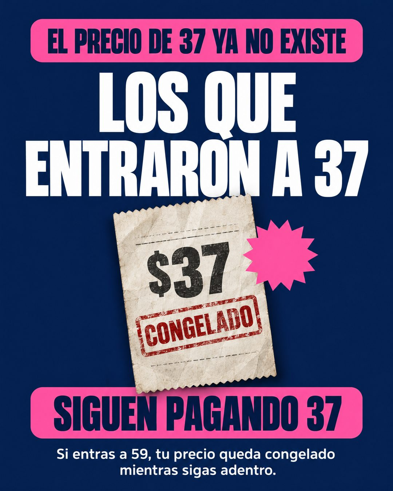

# 196 · Afiche de precio congelado (Low-stock alert)

**Familia:** Oferta y precio · **Necesitas:** Nada · **Resultado en Meta:** Sin datos propios todavía



## Qué es
Un afiche de fondo azul oscuro con letras blancas gigantes que cuenta que el precio viejo ya no existe, pero que quienes entraron a ese precio lo siguen pagando. Al centro, un recibo de papel con un timbre de congelado.

## Por qué funciona
Anuncia una subida de precio sin decir que subió: la noticia es que a los primeros se les respetó el precio, y eso crea urgencia por entrar antes de la próxima. La precisión de la oferta lo sostiene: la regla de congelamiento va completa y legible.

## Cuándo usarlo
Remarketing o público tibio que vio la oferta y no entró. Sirve para membresías, suscripciones o servicios mensuales que congelan el precio a quienes entran antes; el objetivo es empujar la compra con urgencia real.

## Así lo hicimos para Imperio
- **Texto en la imagen:** EL PRECIO DE 37 YA NO EXISTE (franja rosada) / LOS QUE / ENTRARON A 37 / $37 / CONGELADO (boleta de papel con timbre rojo) / SIGUEN PAGANDO 37 (franja rosada) / Si entras a 59, tu precio queda congelado / mientras sigas adentro.
- **Texto principal:**
  > Los que entraron a 37 siguen pagando 37.
  >
  > Si entras a 59, ese número queda congelado mientras sigas adentro. Así funciona acá desde el principio.
  >
  > Imperio Agéntico 👇

## Receta para tu marca
- **Franja superior:** barra rosada con texto azul oscuro: EL PRECIO DE [PRECIO ANTERIOR] YA NO EXISTE.
- **Titular:** blanco, condensado y gigante: LOS QUE / ENTRARON A [PRECIO ANTERIOR].
- **Objeto:** un recibo de papel arrugado con [PRECIO ANTERIOR CON SIGNO] y un timbre rojo de CONGELADO, más una estrella de sticker en el color de acento.
- **Remate:** barra rosada con SIGUEN PAGANDO [PRECIO ANTERIOR] y, debajo en blanco chico: Si entras a [PRECIO ACTUAL], tu precio queda congelado mientras sigas adentro.
- **Colores:** azul marino de fondo, blanco y un rosado fuerte de acento; cambia el rosado por tu color si contrasta igual.
- **Lo que no se toca:** la regla de congelamiento completa y legible. Si falta la condición (mientras sigas adentro), la oferta queda imprecisa.

## Prompt con que se hizo el de Imperio (GPT Image 2.5)
```
Navy blue poster ad. Pink label bar at the top 'EL PRECIO DE 37 YA NO EXISTE'. Huge white bold condensed text 'LOS QUE' / 'ENTRARON A 37'. Middle: an old paper receipt with '$37' and a red stamp 'CONGELADO', with a pink starburst sticker. Pink bar 'SIGUEN PAGANDO 37'. Bottom small white text 'Si entras a 59, tu precio queda congelado mientras sigas adentro.' Vertical 4:5 Instagram/Facebook feed ad, sharp and professional. All on-image text is Spanish and must be rendered EXACTLY as written inside the quotes, with every accent and ñ correct and every digit exact. Never use inverted question marks or inverted exclamation marks. No em dashes. Do not add any other words, logos or watermarks.
```

## Ojo
- Úsalo solo si el precio anterior existió y tus clientes antiguos de verdad lo siguen pagando.
- Si sale texto roto, manos deformes o cifras mal escritas, se rehace.
- Marca la casilla de contenido generado por IA en el Administrador de anuncios.
