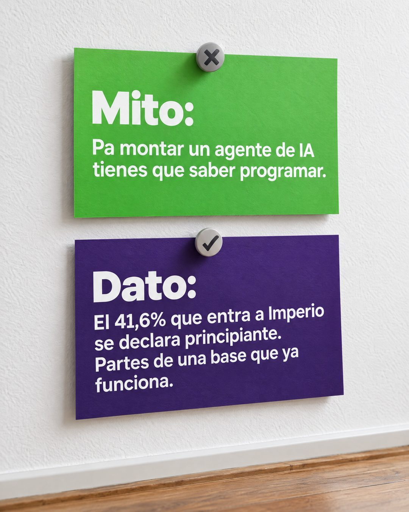

# 197 · Mito y dato en tarjetas (Myth vs fact)

**Familia:** Objeto físico con texto · **Necesitas:** Un dato real de tus clientes que desarme el mito · **Resultado en Meta:** Sin datos propios todavía



## Qué es
Dos tarjetas de cartulina clavadas con chinches en una pared: arriba el mito que frena al cliente, marcado con una X, y abajo el dato real que lo desarma, marcado con un check.

## Por qué funciona
Nombra en voz alta la creencia que impide comprar y la contesta con un número propio, no con una promesa. Las tarjetas en la pared son un objeto real y el par mito y dato se entiende sin explicación.

## Cuándo usarlo
Público frío o tibio con una creencia que lo frena (es caro, es difícil, no es para mí). Sirve para cualquier negocio con datos propios de sus clientes; el objetivo es responder una objeción con evidencia.

## Así lo hicimos para Imperio
- **Texto en la imagen:** Mito: / Pa montar un agente de IA tienes que saber programar. (tarjeta verde, chinche con una X) / Dato: / El 41,6% que entra a Imperio se declara principiante. Partes de una base que ya funciona. (tarjeta morada, chinche con un check)
- **Texto principal:**
  > Mito: pa montar un agente de IA tienes que saber programar.
  >
  > Dato: el 41,6% de los que entran se declara principiante. Partes de una base que ya funciona y la adaptas.
  >
  > $59 al mes 👇

## Receta para tu marca
- **Escena:** foto de una pared blanca con textura y un rincón de piso de madera abajo, con luz natural de día.
- **Tarjeta 1:** cartulina de [COLOR 1] con una chinche gris con X: Mito: (grande, blanco, grueso) / [LA CREENCIA QUE FRENA A TU CLIENTE].
- **Tarjeta 2:** cartulina de [COLOR 2] con una chinche con check: Dato: / [TU DATO REAL CON CIFRA]. [QUÉ SIGNIFICA PARA EL CLIENTE].
- **Colores:** dos colores fuertes que contrasten entre sí; tu color de marca va en la tarjeta del dato.
- **Lo que no se toca:** el dato es tuyo, real y con su cifra exacta. Un dato vago o prestado convierte el formato en otro mito.

## Prompt con que se hizo el de Imperio (GPT Image 2.5)
```
Photo of a white wall with two cards pinned by pushpins: a bright green card with a grey X pin, bold white 'Mito:' and text 'Pa montar un agente de IA tienes que saber programar.'; below, a deep purple card with a check pin, bold white 'Dato:' and text 'El 41,6% que entra a Imperio se declara principiante. Partes de una base que ya funciona.' Wooden floor corner at the bottom. Vertical 4:5 Instagram/Facebook feed ad, sharp and professional. All on-image text is Spanish and must be rendered EXACTLY as written inside the quotes, with every accent and ñ correct and every digit exact. Never use inverted question marks or inverted exclamation marks. No em dashes. Do not add any other words, logos or watermarks.
```

## Ojo
- El dato tiene que salir de tus propios registros o encuestas y debes poder mostrarlo si alguien lo pide.
- Si sale texto roto, manos deformes o cifras mal escritas, se rehace.
- Marca la casilla de contenido generado por IA en el Administrador de anuncios.
