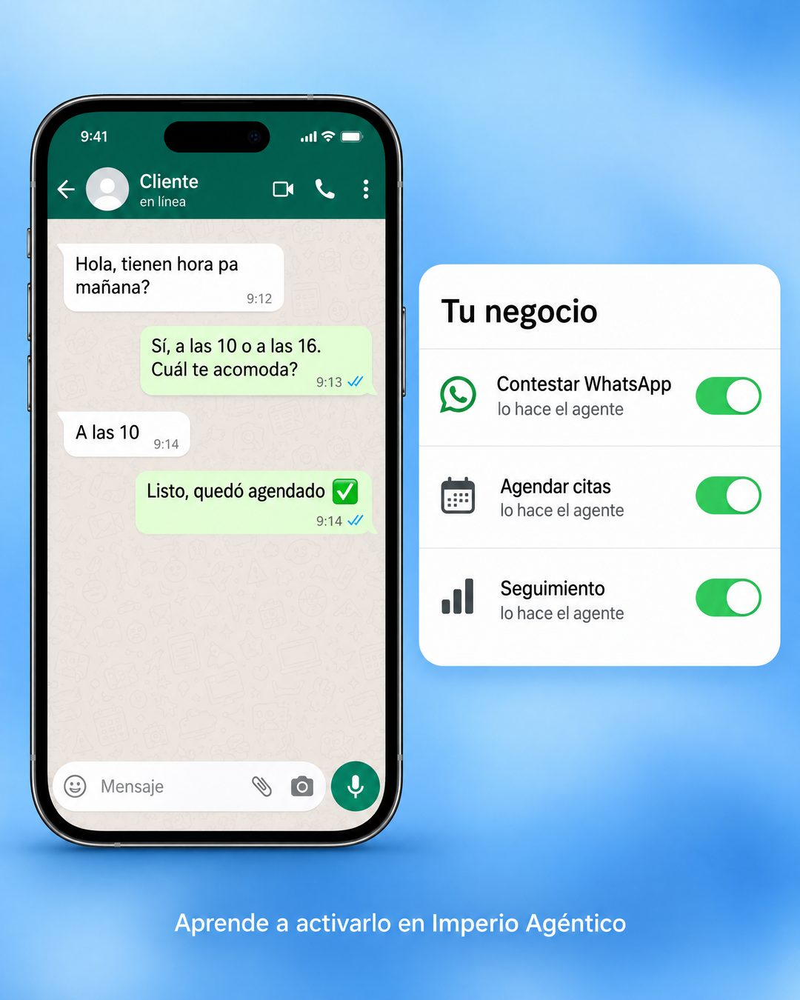

# 198 · Panel de ajustes con interruptores

**Familia:** Interfaz creíble · **Necesitas:** Nada · **Resultado en Meta:** Sin datos propios todavía



## Qué es
Un teléfono con un chat de demostración completo (pregunta, respuesta, elección y confirmación) junto a un panel estilo ajustes del iPhone con el nombre del negocio, donde cada tarea pesada aparece encendida y con una línea que dice quién la hace ahora.

## Por qué funciona
El panel de ajustes es una pantalla que todos usan a diario, así que la idea de activar una tarea se entiende sin leer. El chat de al lado muestra que lo encendido funciona de punta a punta, hasta la cita agendada.

## Cuándo usarlo
Público tibio que ya entiende el problema y quiere ver cómo se ve resuelto. Sirve para software, automatizaciones o servicios que se activan (agenda, atención, cobranza); el objetivo es mostrar el producto en uso y bajar la fricción.

## Así lo hicimos para Imperio
- **Texto en la imagen:** [teléfono con un chat, contacto Cliente, en línea:] Hola, tienen hora pa mañana? / Sí, a las 10 o a las 16. Cuál te acomoda? / A las 10 / Listo, quedó agendado ✅ / Tu negocio / Contestar WhatsApp / lo hace el agente / Agendar citas / lo hace el agente / Seguimiento / lo hace el agente (tres interruptores verdes encendidos) / Aprende a activarlo en Imperio Agéntico (abajo)
- **Texto principal:**
  > Contestar WhatsApp, agendar citas, hacer seguimiento. Tres cosas que puede hacer el agente.
  >
  > En Imperio aprendes a activarlo, paso a paso y en español.
  >
  > Tu primer agente en 7 días o te devolvemos el 100%. $59 al mes 👇

## Receta para tu marca
- **Fondo:** degradado suave en [TU COLOR DE MARCA EN TONO CLARO], sin texturas.
- **Teléfono:** a la izquierda, un chat de demostración de cuatro mensajes: [PREGUNTA DEL CLIENTE] / [RESPUESTA DE TU PRODUCTO] / [ELECCIÓN DEL CLIENTE] / [CONFIRMACIÓN CON UN CHECK VERDE].
- **Panel:** a la derecha, una tarjeta blanca estilo ajustes del iPhone con el título [TU NEGOCIO O EL DE TU CLIENTE] y tres filas con ícono, [TAREA 1 A 3] y debajo [QUIÉN LA HACE AHORA], cada una con interruptor verde encendido.
- **Pie:** una línea blanca abajo: [DÓNDE SE APRENDE O SE ACTIVA].
- **Lo que no se toca:** los interruptores encendidos y verdes, y el chat que termina en una acción cumplida (una cita, una compra, un pago).

## Prompt con que se hizo el de Imperio (GPT Image 2.5)
```
Soft blue gradient background. Left: a smartphone standing upright showing a WhatsApp chat with only these messages: customer 'Hola, tienen hora pa mañana?', agent 'Sí, a las 10 o a las 16. Cuál te acomoda?', customer 'A las 10', agent 'Listo, quedó agendado ✅'. Right: an iOS Settings-style white rounded panel titled 'Tu negocio' with three rows and green toggles ON: 'Contestar WhatsApp · lo hace el agente', 'Agendar citas · lo hace el agente', 'Seguimiento · lo hace el agente'. Bottom small text 'Aprende a activarlo en Imperio Agéntico'. Every chat message is written WITHOUT inverted question marks and WITHOUT inverted exclamation marks (never the characters U+00BF or U+00A1 anywhere, questions only end with ?). Vertical 4:5 Instagram/Facebook feed ad, sharp and professional. All on-image text is Spanish and must be rendered EXACTLY as written inside the quotes, with every accent and ñ correct and every digit exact. Never use inverted question marks or inverted exclamation marks. No em dashes. Do not add any other words, logos or watermarks.
```

## Ojo
- El chat es una demostración de tu producto: nunca lo presentes como la conversación de un cliente real.
- Usa íconos genéricos en el panel: nada de logos de WhatsApp u otras marcas sin permiso.
- Marca la casilla de contenido generado por IA en el Administrador de anuncios.
