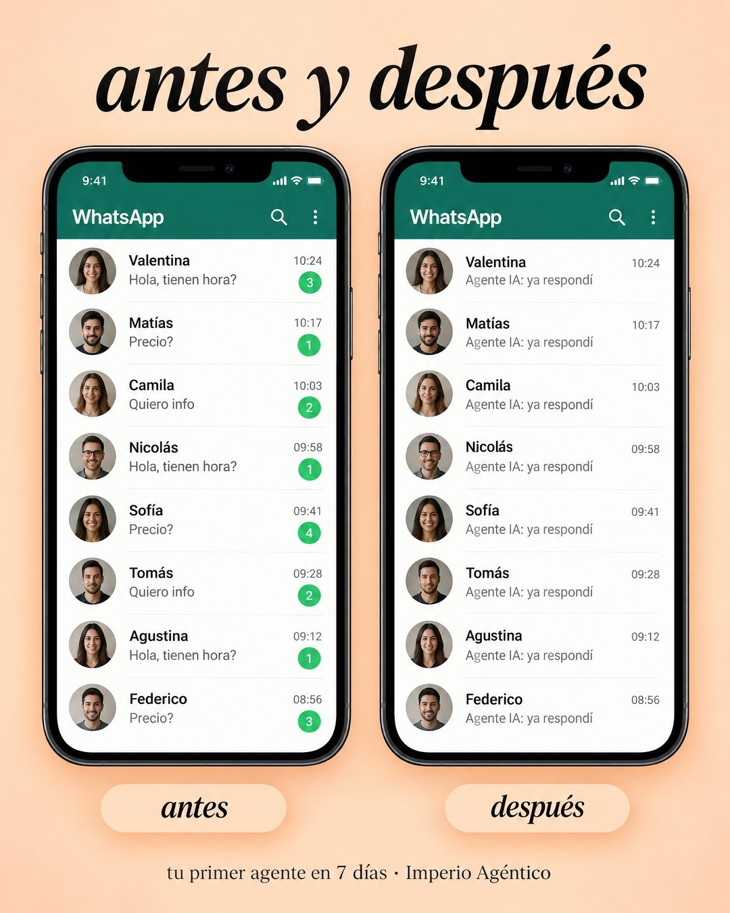

# 199 · Bandeja antes y después (Transformation)

**Familia:** Diagrama y dato · **Necesitas:** Nada · **Resultado en Meta:** Sin datos propios todavía



## Qué es
Dos capturas iguales de una bandeja de mensajes lado a lado: antes, todos los chats con preguntas sin contestar y globos de no leídos; después, los mismos chats ya respondidos por tu producto.

## Por qué funciona
El antes y después se entiende sin texto, y aquí la transformación ocurre en algo que el cliente mira todos los días: su propia bandeja. Mismos nombres, mismas horas, y lo único que cambia es quién respondió.

## Cuándo usarlo
Público frío o tibio que recibe muchas consultas y no da abasto. Sirve para negocios que atienden por chat (salud, belleza, inmobiliarias, comercio); el objetivo es frenar el scroll y mostrar el resultado de un vistazo.

## Así lo hicimos para Imperio
- **Texto en la imagen:** antes y después / [dos teléfonos con la lista de chats de WhatsApp: los mismos 8 contactos con foto, nombre y hora] / Izquierda: Hola, tienen hora? / Precio? / Quiero info (con globos verdes de no leídos) / Derecha: Agente IA: ya respondí (en todas las filas, sin globos) / antes / después (etiquetas bajo cada teléfono) / tu primer agente en 7 días · Imperio Agéntico
- **Texto principal:**
  > Antes: una bandeja llena de "Hola, tienen hora?" sin contestar.
  >
  > Después: el agente ya respondió.
  >
  > Lo armas en 7 días o te devolvemos el 100%. $59 al mes 👇

## Receta para tu marca
- **Titular:** arriba, serif en cursiva negra: antes y después.
- **Pantallas:** dos teléfonos iguales con la misma lista de [TU CANAL DE MENSAJES]; a la izquierda cada fila con [CONSULTA TÍPICA DE TU CLIENTE] y globos de no leídos, a la derecha las mismas filas con [LA RESPUESTA DE TU PRODUCTO] y sin globos.
- **Contactos:** nombres de pila comunes y avatares genéricos, idénticos en los dos teléfonos.
- **Etiquetas y pie:** una píldora bajo cada teléfono (antes / después) y una línea chica: [TU PROMESA CON PLAZO] · [TU MARCA].
- **Colores:** fondo durazno suave o el tono claro de tu marca; el verde de los globos solo en el antes.
- **Lo que no se toca:** mismos contactos, mismas horas y mismo orden en las dos pantallas. Si cambia algo más que la respuesta, la comparación se rompe.

## Prompt con que se hizo el de Imperio (GPT Image 2.5)
```
Warm peach background ad. Italic serif title 'antes y después'. Two rounded phone screenshots side by side of a WhatsApp chat list: left labeled 'antes', every row shows the preview 'Hola, tienen hora?' or 'Precio?' or 'Quiero info' with green unread badges; right labeled 'después', the same rows all with the preview 'Agente IA: ya respondí' and no badges. Small bottom text 'tu primer agente en 7 días · Imperio Agéntico'. Every chat message is written WITHOUT inverted question marks and WITHOUT inverted exclamation marks (never the characters U+00BF or U+00A1 anywhere, questions only end with ?). Vertical 4:5 Instagram/Facebook feed ad, sharp and professional. All on-image text is Spanish and must be rendered EXACTLY as written inside the quotes, with every accent and ñ correct and every digit exact. Never use inverted question marks or inverted exclamation marks. No em dashes. Do not add any other words, logos or watermarks.
```

## Ojo
- Los contactos son de demostración: nombres genéricos y caras que no correspondan a clientes reales.
- Si sale texto roto, manos deformes o cifras mal escritas, se rehace.
- Marca la casilla de contenido generado por IA en el Administrador de anuncios.
