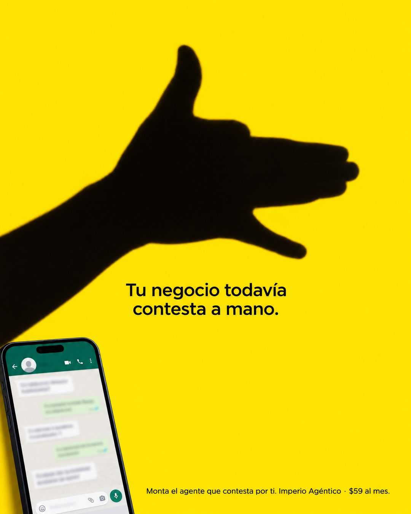

# 202 · Sombra chinesca con frase seca

**Familia:** Humor y meme · **Necesitas:** Nada · **Resultado en Meta:** Sin datos propios todavía



## Qué es
Un fondo de color plano, la sombra de una mano que forma un perro y una sola frase que convierte la figura en un juego de palabras sobre el problema del cliente. En el ejemplo de Imperio, la mano es literal: el negocio todavía contesta los mensajes a mano.

## Por qué funciona
La sombra chinesca es una imagen que todos reconocen y que no parece anuncio, así que frena el scroll. La frase se entiende en un segundo y afirma algo concreto e incómodo: estás haciendo a mano algo que ya no hace falta.

## Cuándo usarlo
Público frío, para negocios que reemplazan una tarea manual que se repite: responder mensajes, agendar, cotizar, llevar cuentas. Sirve para frenar el scroll y nombrar el problema antes de mostrar la solución.

## Así lo hicimos para Imperio
- **Texto en la imagen:** Tu negocio todavía contesta a mano. (centrado, bajo la sombra) / [teléfono con un chat de WhatsApp desenfocado, abajo a la izquierda] / Monta el agente que contesta por ti. Imperio Agéntico · $59 al mes. (letra chica, abajo a la derecha)
- **Texto principal:**
  > Tu negocio todavía contesta a mano. Y cada mensaje que llega de noche espera hasta mañana.
  >
  > Monta el agente que contesta por ti. En Imperio lo armas en 7 días o te devolvemos el 100%.
  >
  > $59 al mes 👇

## Receta para tu marca
- **Fondo:** un color plano y saturado de tu marca (en el ejemplo, amarillo) en todo el cuadro.
- **Figura:** la sombra negra de una mano formando [UN ANIMAL CLÁSICO DE SOMBRA CHINESCA], grande, en la mitad superior.
- **Texto:** una frase centrada bajo la sombra: [LO QUE TU CLIENTE TODAVÍA HACE A MANO, EN 6 PALABRAS O MENOS].
- **Apoyo:** abajo a la izquierda, [EL LUGAR DONDE PASA EL PROBLEMA] con todo el contenido desenfocado; abajo a la derecha, en letra chica: [TU SOLUCIÓN EN UNA FRASE]. [TU MARCA] · [TU PRECIO].
- **Lo que no se toca:** una sola sombra, una sola frase y la marca en letra chica: el juego de palabras se entiende solo.

## Prompt con que se hizo el de Imperio (GPT Image 2.5)
```
Bright yellow background. Center: the black shadow of a hand making the classic barking-dog hand shadow puppet on the wall: fingers held together forming the snout, the pinky lowered as the open jaw, the thumb raised as the ear. No pointing finger, nothing that looks like a gun. Small black text centered under it: 'Tu negocio todavía contesta a mano.' Bottom-left small: a phone showing a WhatsApp chat whose message texts are blurred and illegible. Bottom fine text 'Monta el agente que contesta por ti. Imperio Agéntico · $59 al mes.' Vertical 4:5 Instagram/Facebook feed ad, sharp and professional. All on-image text is Spanish and must be rendered EXACTLY as written inside the quotes, with every accent and ñ correct and every digit exact. Never use inverted question marks or inverted exclamation marks. No em dashes. Do not add any other words, logos or watermarks.
```

## Ojo
- La sombra tiene que leerse como un animal y nunca como una mano que apunta o un arma: pídelo explícito en el prompt.
- Si sale texto roto, manos deformes o cifras mal escritas, se rehace.
- Marca la casilla de contenido generado por IA en el Administrador de anuncios.
