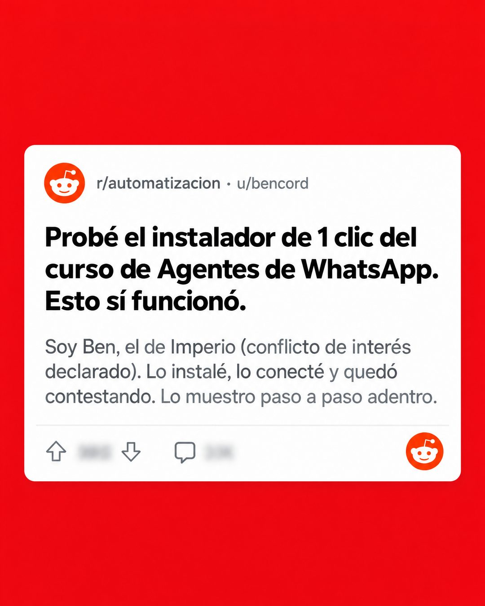

# 203 · Post de foro con conflicto declarado (Reddit style)

**Familia:** Interfaz creíble · **Necesitas:** Nada · **Resultado en Meta:** Sin datos propios todavía



## Qué es
Una tarjeta de post de foro sobre un fondo de color plano, escrita en primera persona por el dueño de la marca, que prueba su propio producto y declara el conflicto de interés en el mismo texto. En el ejemplo de Imperio, Ben cuenta que instaló el agente de WhatsApp del curso y que quedó contestando.

## Por qué funciona
Un post de foro se lee como la opinión de alguien que probó algo, no como publicidad, así que el ojo lo lee completo. Declarar el conflicto de interés desarma la sospecha antes de que aparezca y vuelve creíble el resto: el dueño sabe que es su producto y lo dice.

## Cuándo usarlo
Público frío o tibio que desconfía de los anuncios, para productos que se pueden probar y mostrar funcionando. Sirve para mostrar prueba de uso sin inventar un testimonio.

## Así lo hicimos para Imperio
- **Texto en la imagen:** r/automatizacion · u/bencord / Probé el instalador de 1 clic del curso de Agentes de WhatsApp. Esto sí funcionó. / Soy Ben, el de Imperio (conflicto de interés declarado). Lo instalé, lo conecté y quedó contestando. Lo muestro paso a paso adentro. / [votos y comentarios desenfocados, logo de Reddit arriba a la izquierda y abajo a la derecha]
- **Texto principal:**
  > Probé el instalador de 1 clic del curso de Agentes de WhatsApp. Esto sí funcionó.
  >
  > Conflicto de interés declarado: el curso es de Imperio (jajaja). Adentro lo muestro paso a paso.
  >
  > $59 al mes 👇

## Receta para tu marca
- **Fondo:** color plano y fuerte de tu marca (en el ejemplo, rojo) con la tarjeta blanca centrada.
- **Cabecera:** r/[TU TEMA] · u/[TU USUARIO REAL], con un avatar de foro genérico.
- **Titular:** en negrita negra: Probé [LO QUE PROBASTE DE TU PRODUCTO]. Esto sí funcionó.
- **Cuerpo:** en gris: Soy [TU NOMBRE], el de [TU MARCA] (conflicto de interés declarado). [QUÉ HICISTE Y QUÉ PASÓ, EN DOS FRASES].
- **Lo que no se toca:** la primera persona, el conflicto declarado dentro del post y los votos y comentarios desenfocados.

## Prompt con que se hizo el de Imperio (GPT Image 2.5)
```
Solid red background. A white Reddit post card centered: 'r/automatizacion · u/bencord', bold title 'Probé el instalador de 1 clic del curso de Agentes de WhatsApp. Esto sí funcionó.', grey body 'Soy Ben, el de Imperio (conflicto de interés declarado). Lo instalé, lo conecté y quedó contestando. Lo muestro paso a paso adentro.' Reddit logo bottom right; vote and comment counts blurred. Vertical 4:5 Instagram/Facebook feed ad, sharp and professional. All on-image text is Spanish and must be rendered EXACTLY as written inside the quotes, with every accent and ñ correct and every digit exact. Never use inverted question marks or inverted exclamation marks. No em dashes. Do not add any other words, logos or watermarks.
```

## Ojo
- El post es tuyo y lo dice: nunca lo firmes con el nombre de un cliente ni muestres votos o comentarios que no existen.
- No uses el logo de Reddit ni de otra plataforma sin permiso: una tarjeta de foro genérica funciona igual.
- Marca la casilla de contenido generado por IA en el Administrador de anuncios.
