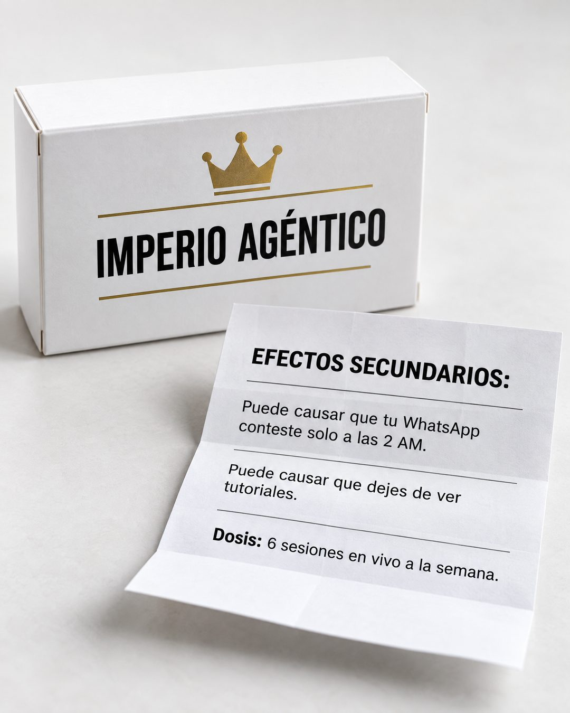

# 204 · Caja de remedio con efectos secundarios (Side effect)

**Familia:** Objeto físico con texto · **Necesitas:** Tu logo · **Resultado en Meta:** Sin datos propios todavía



## Qué es
Una foto de producto de farmacia: una caja blanca con tu marca y un prospecto doblado donde los efectos secundarios son los beneficios de tu oferta, escritos con el tono serio de un remedio. La dosis es lo que incluye tu producto.

## Por qué funciona
El tono serio del prospecto choca con lo que dice y obliga a leer cada línea para entender el chiste. Cada efecto es un beneficio con un detalle concreto (a las 2 AM, 6 sesiones a la semana), no una promesa vaga, y el objeto fotografiado rinde más que un diseño plano.

## Cuándo usarlo
Público frío y tibio, para productos o servicios cuyos resultados se pueden contar como un efecto: software, educación, servicios, productos para el hogar. Sirve para frenar el scroll y listar beneficios sin que parezca una lista de beneficios.

## Así lo hicimos para Imperio
- **Texto en la imagen:** IMPERIO AGÉNTICO (en la caja, bajo una corona dorada y entre dos líneas doradas) / EFECTOS SECUNDARIOS: / Puede causar que tu WhatsApp conteste solo a las 2 AM. / Puede causar que dejes de ver tutoriales. / Dosis: 6 sesiones en vivo a la semana.
- **Texto principal:**
  > Efectos secundarios de entrar a Imperio: tu WhatsApp contesta solo a las 2 AM y dejas de ver tutoriales.
  >
  > Dosis: 6 sesiones en vivo a la semana.
  >
  > $59 al mes 👇

## Receta para tu marca
- **Escena:** foto de estudio sobre una superficie clara: una caja blanca tipo farmacia con [TU LOGO] y, al lado, un prospecto doblado con marcas de pliegue.
- **Titular:** en el prospecto, EFECTOS SECUNDARIOS: en negrita mayúscula, con líneas finas que separan cada efecto.
- **Texto:** dos líneas que empiezan con "Puede causar que" + [UN BENEFICIO CONCRETO CON HORA, NÚMERO O DETALLE] y una final: "Dosis:" + [LO QUE INCLUYE TU OFERTA, CON CANTIDAD].
- **Colores:** blanco y negro de farmacia; el color de tu marca solo en el logo de la caja.
- **Lo que no se toca:** el tono serio de prospecto; si suena a eslogan, se pierde el chiste.

## Prompt con que se hizo el de Imperio (GPT Image 2.5)
```
Photo of a white pharmacy-style medicine box on a clean light surface, printed bold label [TU MARCA: logo y nombre]. Next to it a folded leaflet with printed heading 'EFECTOS SECUNDARIOS:' and lines 'Puede causar que tu WhatsApp conteste solo a las 2 AM.', 'Puede causar que dejes de ver tutoriales.', 'Dosis: 6 sesiones en vivo a la semana.' Vertical 4:5 Instagram/Facebook feed ad, sharp and professional. All on-image text is Spanish and must be rendered EXACTLY as written inside the quotes, with every accent and ñ correct and every digit exact. Never use inverted question marks or inverted exclamation marks. No em dashes. Do not add any other words, logos or watermarks.
```

## Ojo
- Si vendes salud, suplementos o algo que se toma, no uses este formato con efectos del producto: Meta revisa con lupa las afirmaciones de salud.
- Si sale texto roto, manos deformes o cifras mal escritas, se rehace.
- Marca la casilla de contenido generado por IA en el Administrador de anuncios.
