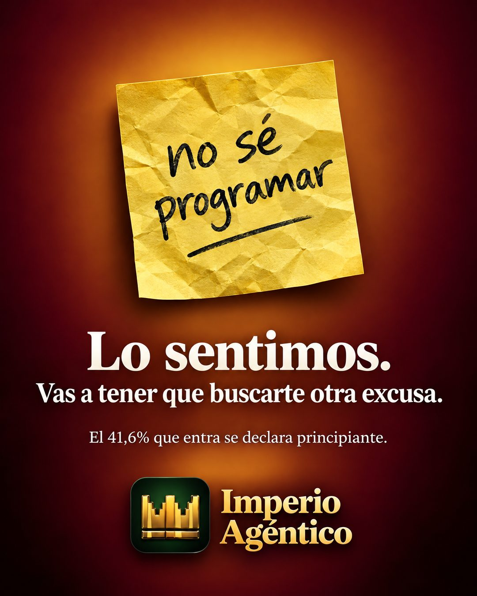

# 205 · Post-it con la excusa (We're sorry)

**Familia:** Objeto físico con texto · **Necesitas:** Tu logo. Un dato real contra la excusa, si lo tienes · **Resultado en Meta:** Sin datos propios todavía



## Qué es
Un post-it arrugado con la excusa típica de tu cliente escrita a mano y, debajo, una disculpa irónica de la marca: lo sentimos, vas a tener que buscarte otra excusa. Cierra con un dato que desarma esa excusa y tu logo.

## Por qué funciona
No es normal ver a una marca disculpándose, y menos para quitarle la excusa al cliente: esa curiosidad engancha. La excusa escrita a mano es la frase que el cliente se dice a sí mismo, y el dato de abajo la contesta con algo verificable.

## Cuándo usarlo
Público tibio que te conoce pero no compra por una objeción concreta (no tengo tiempo, no sé hacerlo, no es para mí). Sirve para responder esa objeción con humor y un dato.

## Así lo hicimos para Imperio
- **Texto en la imagen:** no sé programar (a mano, en un post-it amarillo arrugado) / Lo sentimos. / Vas a tener que buscarte otra excusa. / El 41,6% que entra se declara principiante. / Imperio Agéntico (junto al ícono de la corona, abajo)
- **Texto principal:**
  > Lo sentimos: "no sé programar" ya no sirve como excusa.
  >
  > El 41,6% que entra se declara principiante. Nadie parte de cero: partes de un agente que ya funciona.
  >
  > $59 al mes 👇

## Receta para tu marca
- **Fondo:** degradado cálido y oscuro (en el ejemplo, ámbar a granate) con luz al centro.
- **Objeto:** un post-it amarillo arrugado con [LA EXCUSA QUE MÁS ESCUCHAS, EN MINÚSCULA Y A MANO], subrayada.
- **Texto:** en serif blanca, "Lo sentimos." en grande y debajo "Vas a tener que buscarte otra excusa." Más abajo y más chico: [UN DATO REAL QUE DESARMA LA EXCUSA].
- **Marca:** [TU LOGO] centrado abajo.
- **Lo que no se toca:** la excusa en las palabras del cliente y una disculpa seca, sin explicar el chiste.

## Prompt con que se hizo el de Imperio (GPT Image 2.5)
```
Warm amber-to-maroon radial gradient background. Center: a crumpled yellow sticky note with handwriting 'no sé programar'. Below, white serif 'Lo sentimos.' and smaller 'Vas a tener que buscarte otra excusa.' and tiny 'El 41,6% que entra se declara principiante.' At the bottom: [TU MARCA: logo y nombre]  Vertical 4:5 Instagram/Facebook feed ad, sharp and professional. All on-image text is Spanish and must be rendered EXACTLY as written inside the quotes, with every accent and ñ correct and every digit exact. Never use inverted question marks or inverted exclamation marks. No em dashes. Do not add any other words, logos or watermarks.
```

## Ojo
- El dato chico tiene que ser real y verificable (una encuesta, tus registros); si no lo tienes, deja solo la disculpa.
- Si sale texto roto, manos deformes o cifras mal escritas, se rehace.
- Marca la casilla de contenido generado por IA en el Administrador de anuncios.
