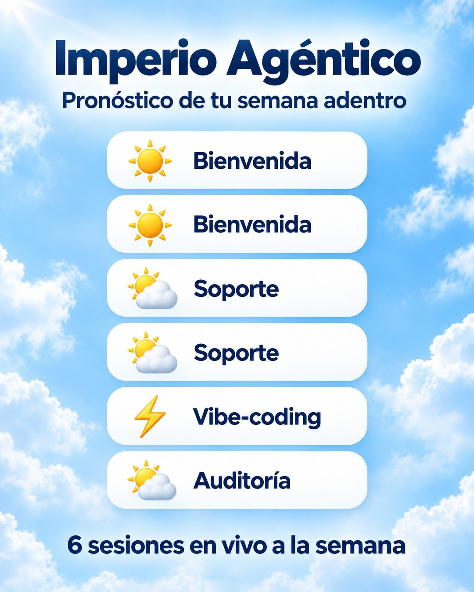

# 206 · Pronóstico del clima de tu semana

**Familia:** Diagrama y dato · **Necesitas:** Nada · **Resultado en Meta:** Sin datos propios todavía



## Qué es
Lo que el cliente recibe en una semana, presentado como un pronóstico del tiempo: fondo de cielo y filas blancas con un emoji de clima y el nombre de cada sesión o entrega. En el ejemplo de Imperio son las 6 sesiones en vivo de la semana, sin días.

## Por qué funciona
Un pronóstico se lee de arriba abajo sin esfuerzo y muestra lo que el cliente recibe cada semana, en vez de contarlo en un párrafo. Cada fila afirma algo concreto que pasa, y el cielo y los emojis le quitan peso a un anuncio con mucha información.

## Cuándo usarlo
Público tibio que duda de cuánto recibe por lo que paga, en membresías, comunidades, gimnasios, academias o servicios recurrentes. Sirve para mostrar el contenido de la oferta y responder la duda de valor.

## Así lo hicimos para Imperio
- **Texto en la imagen:** Imperio Agéntico / Pronóstico de tu semana adentro / ☀️ Bienvenida / ☀️ Bienvenida / ⛅ Soporte / ⛅ Soporte / ⚡ Vibe-coding / ⛅ Auditoría / 6 sesiones en vivo a la semana
- **Texto principal:**
  > Pronóstico de tu semana adentro: 2 sesiones de bienvenida, 2 de soporte, 1 de vibe-coding y 1 de auditoría de lo que estás construyendo.
  >
  > 6 en vivo a la semana. $59 al mes 👇

## Receta para tu marca
- **Fondo:** cielo celeste con nubes y un destello de sol arriba a la izquierda.
- **Titular:** [TU MARCA] en azul oscuro y grande, y debajo "Pronóstico de tu semana adentro".
- **Filas:** de 4 a 6 píldoras blancas, cada una con un emoji de clima y [EL NOMBRE DE UNA SESIÓN O ENTREGA]; repetir una fila está bien si se repite en la realidad.
- **Cierre:** abajo, en azul oscuro: [CUÁNTAS SESIONES O ENTREGAS HAY A LA SEMANA].
- **Lo que no se toca:** que cada fila sea algo que de verdad pasa esa semana, sin días ni horarios si pueden cambiar.

## Prompt con que se hizo el de Imperio (GPT Image 2.5)
```
Sky-blue cloudy gradient ad. Top: 'Imperio Agéntico' and subtitle 'Pronóstico de tu semana adentro'. Six white rounded rows, each with a weather emoji and a label: '☀ Bienvenida', '☀ Bienvenida', '⛅ Soporte', '⛅ Soporte', '⚡ Vibe-coding', '🌤 Auditoría'. No day names. Bottom: '6 sesiones en vivo a la semana'. Vertical 4:5 Instagram/Facebook feed ad, sharp and professional. All on-image text is Spanish and must be rendered EXACTLY as written inside the quotes, with every accent and ñ correct and every digit exact. Never use inverted question marks or inverted exclamation marks. No em dashes. Do not add any other words, logos or watermarks.
```

## Ojo
- Muestra solo lo que entregas hoy: si una sesión se cancela o cambia, cambia también el anuncio.
- Si sale texto roto, manos deformes o cifras mal escritas, se rehace.
- Marca la casilla de contenido generado por IA en el Administrador de anuncios.
