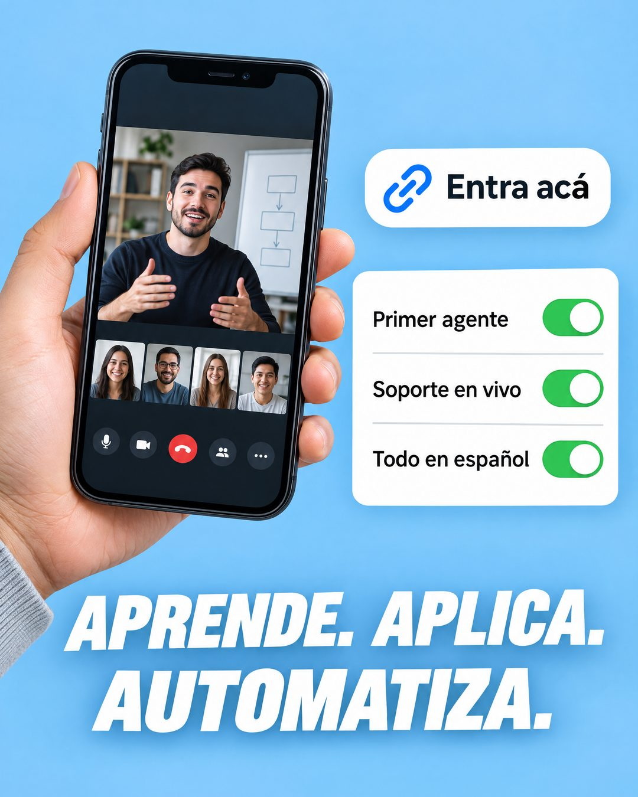

# 207 · Story con stickers de la oferta (Instagram story)

**Familia:** Interfaz creíble · **Necesitas:** Nada. Si tienes una captura real de tu producto, mejor · **Resultado en Meta:** Sin datos propios todavía



## Qué es
Una historia de Instagram armada como anuncio: una mano sostiene el teléfono con tu producto en uso, un sticker de enlace, una tarjeta con interruptores verdes que enumera lo que incluye y un lema de tres verbos abajo. En el ejemplo de Imperio, la pantalla muestra una sesión en vivo por videollamada.

## Por qué funciona
Copia un formato que la gente ve todo el día en stories, así que no se lee como anuncio de feed. Los interruptores encendidos funcionan como una lista de chequeo: el cliente ve en un segundo que lo que busca ya está incluido.

## Cuándo usarlo
Público frío y tibio, para productos o servicios con tres atributos que el cliente busca y reconoce rápido. Sirve para frenar el scroll y resumir la oferta antes del clic.

## Así lo hicimos para Imperio
- **Texto en la imagen:** [teléfono en la mano con una videollamada: un presentador y cuatro participantes] / Entra acá (sticker de enlace) / Primer agente / Soporte en vivo / Todo en español (tarjeta con interruptores verdes encendidos) / APRENDE. APLICA. / AUTOMATIZA.
- **Texto principal:**
  > Aprende. Aplica. Automatiza.
  >
  > Primer agente, soporte en vivo y todo en español, en Imperio Agéntico.
  >
  > $59 al mes 👇

## Receta para tu marca
- **Fondo:** color plano y claro de tu marca (en el ejemplo, celeste).
- **Escena:** una mano sostiene un teléfono con [TU PRODUCTO O SERVICIO EN USO]; cualquier dato personal en pantalla, desenfocado.
- **Stickers:** uno de enlace con [TU LLAMADO CORTO] y una tarjeta con tres filas, cada una con un interruptor verde encendido: [ATRIBUTO 1], [ATRIBUTO 2] y [ATRIBUTO 3].
- **Lema:** abajo, en blanco, negrita cursiva y mayúscula: [TRES VERBOS CORTOS, CADA UNO CON PUNTO].
- **Lo que no se toca:** la estética de story (stickers redondeados, sombra suave) y solo tres atributos.

## Prompt con que se hizo el de Imperio (GPT Image 2.5)
```
Instagram story on a light blue background: a hand holding a smartphone showing an online classroom. A white link sticker 'Entra acá' with a link icon. A quiz sticker card with three rows and green toggles: 'Primer agente', 'Soporte en vivo', 'Todo en español'. Bottom big white bold italic 'APRENDE. APLICA.' / 'AUTOMATIZA.' Vertical 4:5 Instagram/Facebook feed ad, sharp and professional. All on-image text is Spanish and must be rendered EXACTLY as written inside the quotes, with every accent and ñ correct and every digit exact. Never use inverted question marks or inverted exclamation marks. No em dashes. Do not add any other words, logos or watermarks.
```

## Ojo
- Las caras de la videollamada son generadas: no les pongas nombre ni las presentes como clientes o como tu equipo; si quieres más confianza, usa tu cara.
- Si sale texto roto, manos deformes o cifras mal escritas, se rehace.
- Marca la casilla de contenido generado por IA en el Administrador de anuncios.
