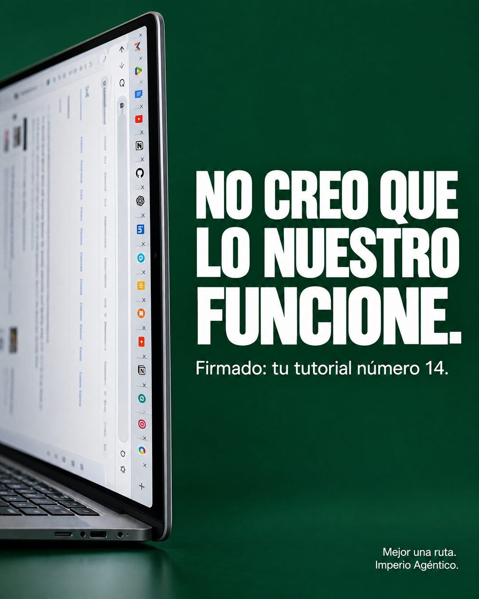

# 209 · Frase de ruptura firmada (Warning)

**Familia:** Tipografía dura · **Necesitas:** Nada · **Resultado en Meta:** Sin datos propios todavía



## Qué es
Una frase de ruptura en mayúscula gigante, como si la escribiera el método viejo que usa tu cliente, y una firma chica que revela quién habla. En el ejemplo de Imperio firma tu tutorial número 14, junto a una laptop de perfil con decenas de pestañas abiertas.

## Por qué funciona
La frase parece un mensaje personal y obliga a leer la firma para entender. El chiste afirma algo concreto: el problema no es el cliente sino el método que lo tiene dando vueltas, y la marca aparece al final como la salida.

## Cuándo usarlo
Público frío o tibio que ya probó la forma gratis o desordenada de resolver su problema. Sirve para frenar el scroll y presentar tu producto como el reemplazo del método viejo.

## Así lo hicimos para Imperio
- **Texto en la imagen:** NO CREO QUE / LO NUESTRO / FUNCIONE. / Firmado: tu tutorial número 14. / Mejor una ruta. / Imperio Agéntico. (letra chica, abajo a la derecha) / [laptop de perfil con decenas de pestañas abiertas y texto desenfocado]
- **Texto principal:**
  > No creo que lo nuestro funcione. Firmado: tu tutorial número 14.
  >
  > Mejor una ruta: un caso, una base que ya funciona y soporte en vivo.
  >
  > Imperio Agéntico, $59 al mes 👇

## Receta para tu marca
- **Fondo:** color oscuro y sólido de tu marca (en el ejemplo, verde profundo).
- **Escena:** a un costado, [EL OBJETO QUE REPRESENTA EL MÉTODO VIEJO], cortado por el borde y con cualquier texto desenfocado.
- **Titular:** sans condensada blanca y enorme, en tres líneas: NO CREO QUE LO NUESTRO FUNCIONE.
- **Firma y cierre:** debajo, chico: Firmado: [EL MÉTODO VIEJO CON UN NÚMERO QUE DUELA]. Abajo a la derecha, en letra chica: [TU ALTERNATIVA EN 3 PALABRAS]. [TU MARCA].
- **Lo que no se toca:** la firma que revela el chiste y la marca en letra chica; si la marca grita, deja de ser un mensaje de ruptura.

## Prompt con que se hizo el de Imperio (GPT Image 2.5)
```
Deep green background. Left: a laptop lying on its side with many browser tabs visible. Big white bold text 'NO CREO QUE' / 'LO NUESTRO' / 'FUNCIONE.' Small white 'Firmado: tu tutorial número 14.' Bottom right small 'Mejor una ruta. Imperio Agéntico.' Vertical 4:5 Instagram/Facebook feed ad, sharp and professional. All on-image text is Spanish and must be rendered EXACTLY as written inside the quotes, with every accent and ñ correct and every digit exact. Never use inverted question marks or inverted exclamation marks. No em dashes. Do not add any other words, logos or watermarks.
```

## Ojo
- Si en la escena aparecen pestañas, apps o pantallas, que queden desenfocadas y sin logos de otras marcas.
- Marca la casilla de contenido generado por IA en el Administrador de anuncios.
