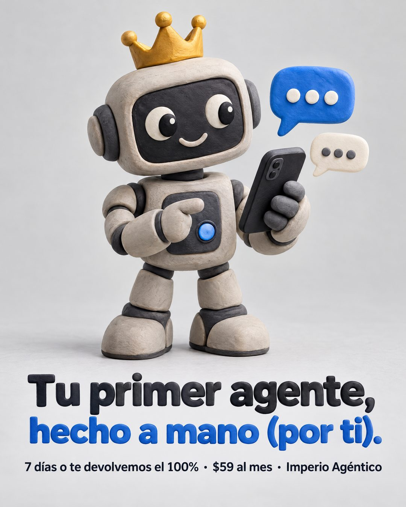

# 210 · Mascota de plastilina (Claymation)

**Familia:** Humor y meme · **Necesitas:** Nada · **Resultado en Meta:** Sin datos propios todavía



## Qué es
Un personaje de plastilina que representa tu producto, sobre un fondo gris liso, con un titular corto en dos tonos y una línea chica con la garantía, el precio y la marca. En el ejemplo de Imperio, un robot con corona sostiene un teléfono con globos de chat.

## Por qué funciona
La plastilina se ve hecha a mano y frena el scroll entre fotos y pantallas. El titular juega con eso (hecho a mano, por ti) y la línea chica cierra con datos duros: plazo, garantía y precio.

## Cuándo usarlo
Público frío, para productos que se explican con un personaje: software, apps, servicios digitales, marcas para familias. Sirve para frenar el scroll y presentar la oferta en una línea.

## Así lo hicimos para Imperio
- **Texto en la imagen:** Tu primer agente, / hecho a mano (por ti). / 7 días o te devolvemos el 100% · $59 al mes · Imperio Agéntico (letra chica, abajo)
- **Texto principal:**
  > Tu primer agente, hecho a mano (por ti).
  >
  > No te lo armamos nosotros: te enseñamos a armarlo y te destrabamos en vivo. 7 días o te devolvemos el 100%.
  >
  > $59 al mes 👇

## Receta para tu marca
- **Estilo:** 3D de plastilina con huellas de dedos visibles, fondo gris claro sin costuras y luz de estudio suave.
- **Personaje:** [TU PRODUCTO O TU MASCOTA COMO FIGURA DE PLASTILINA] haciendo [LA ACCIÓN CLAVE DE TU PRODUCTO], con un detalle de tu marca (en el ejemplo, la corona dorada).
- **Titular:** dos líneas en negrita redondeada: la primera en negro, [QUÉ RECIBE EL CLIENTE], y la segunda en el color de tu marca, [EL GIRO DEL CHISTE].
- **Línea chica:** [TU GARANTÍA REAL] · [TU PRECIO] · [TU MARCA].
- **Lo que no se toca:** un solo personaje centrado y la textura de plastilina; si se ve como 3D liso, se pierde el formato.

## Prompt con que se hizo el de Imperio (GPT Image 2.5)
```
Claymation plasticine 3D style: a cute little clay robot wearing a tiny gold crown, holding a clay smartphone with speech bubbles, on a light grey seamless background. Text: 'Tu primer agente,' / 'hecho a mano (por ti).' and small '7 días o te devolvemos el 100% · $59 al mes · Imperio Agéntico'. Vertical 4:5 Instagram/Facebook feed ad, sharp and professional. All on-image text is Spanish and must be rendered EXACTLY as written inside the quotes, with every accent and ñ correct and every digit exact. Never use inverted question marks or inverted exclamation marks. No em dashes. Do not add any other words, logos or watermarks.
```

## Ojo
- No pongas una garantía que no está escrita en tus condiciones: la línea chica es una promesa.
- Si sale texto roto, manos deformes o cifras mal escritas, se rehace.
- Marca la casilla de contenido generado por IA en el Administrador de anuncios.
