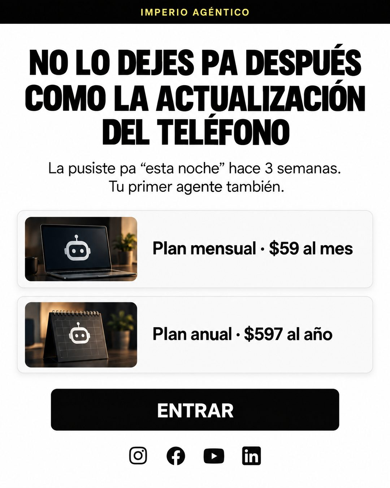

# 212 · Captura de correo con planes (Email screenshot)

**Familia:** Interfaz creíble · **Necesitas:** Nada · **Resultado en Meta:** Sin datos propios todavía



## Qué es
La captura de un correo de marca: barra superior con tu nombre, un titular en mayúscula condensada, dos líneas con una verdad incómoda, dos filas de planes con su precio y un botón. En el ejemplo de Imperio, compara tu primer agente pendiente con la actualización del teléfono que nunca instalas.

## Por qué funciona
Casi todos tenemos una actualización del teléfono pendiente hace semanas, así que la comparación se entiende sin explicar. El correo muestra los dos planes con su precio exacto, lo que responde cuánto cuesta antes del clic.

## Cuándo usarlo
Remarketing y público tibio que ya conoce tu marca y lo está dejando para después. Sirve para empujar la compra y mostrar las opciones de pago.

## Así lo hicimos para Imperio
- **Texto en la imagen:** IMPERIO AGÉNTICO (barra negra superior, letras amarillas) / NO LO DEJES PA DESPUÉS / COMO LA ACTUALIZACIÓN / DEL TELÉFONO / La pusiste pa “esta noche” hace 3 semanas. / Tu primer agente también. / Plan mensual · $59 al mes / Plan anual · $597 al año / ENTRAR (botón negro) / [íconos de Instagram, Facebook, YouTube y LinkedIn al pie]
- **Texto principal:**
  > La actualización del teléfono la dejaste pa "esta noche" hace 3 semanas. Tu primer agente también.
  >
  > Mensual a $59 o anual a $597. Y si en 7 días no tienes tu primer sistema, te devolvemos el 100% 👇

## Receta para tu marca
- **Formato:** captura vertical de un correo sobre blanco, con una barra negra arriba y [TU MARCA] en letras chicas del color de tu marca (en el ejemplo, amarillo).
- **Titular:** sans condensada negra y gruesa: NO LO DEJES PA DESPUÉS COMO [ALGO QUE TODOS POSTERGAN].
- **Texto:** dos líneas: [CUÁNDO LO DEJASTE PENDIENTE]. [TU PRODUCTO] también.
- **Planes:** dos filas con miniatura: [PLAN 1] · [PRECIO 1] y [PLAN 2] · [PRECIO 2]; abajo, un botón negro con [TU LLAMADO EN UNA PALABRA] y los íconos de tus redes.
- **Lo que no se toca:** los precios exactos y vigentes, y el tono de reproche amistoso del titular.

## Prompt con que se hizo el de Imperio (GPT Image 2.5)
```
Email screenshot on white. Top black bar with small yellow text 'IMPERIO AGÉNTICO'. Bold heading 'NO LO DEJES PA DESPUÉS COMO LA ACTUALIZACIÓN DEL TELÉFONO'. Small body 'La pusiste pa “esta noche” hace 3 semanas. Tu primer agente también.' Two product rows with thumbnails: 'Plan mensual · $59 al mes' and 'Plan anual · $597 al año'. Black button 'ENTRAR'. Footer social icons. Vertical 4:5 Instagram/Facebook feed ad, sharp and professional. All on-image text is Spanish and must be rendered EXACTLY as written inside the quotes, with every accent and ñ correct and every digit exact. Never use inverted question marks or inverted exclamation marks. No em dashes. Do not add any other words, logos or watermarks.
```

## Ojo
- Los planes y precios del correo tienen que ser los mismos que el cliente ve al pagar: ni un plan que no existe ni un descuento que ya terminó.
- Si sale texto roto, manos deformes o cifras mal escritas, se rehace.
- Marca la casilla de contenido generado por IA en el Administrador de anuncios.
