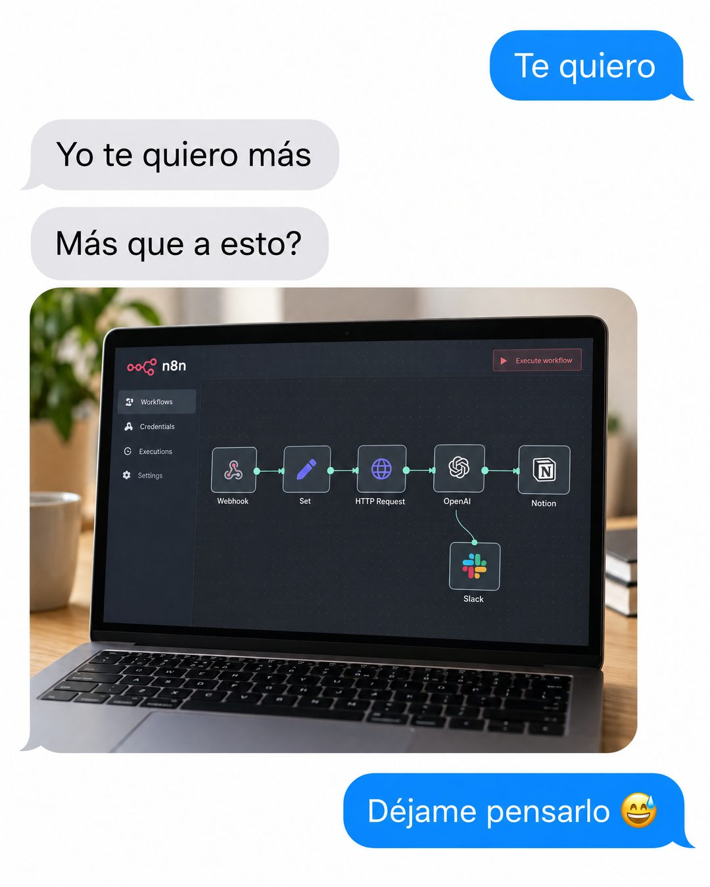

# 213 · Chat del te quiero más (Text message)

**Familia:** Humor y meme · **Necesitas:** Nada. Si tienes una foto real de tu producto, mejor · **Resultado en Meta:** Sin datos propios todavía



## Qué es
Una conversación de mensajería entre pareja: te quiero, yo te quiero más y la pregunta más que a esto, seguida de una foto de tu producto y una respuesta que duda. En el ejemplo de Imperio, la foto es una laptop con un flujo de automatización en n8n.

## Por qué funciona
Es una broma conocida que se entiende en tres burbujas. Pone a tu producto en el lugar del amor rival: le habla a quien ya está enganchado con tu tema y se ríe de él con cariño.

## Cuándo usarlo
Público tibio, para marcas cuyos clientes están enganchados con el tema (software, deporte, cocina, colecciones). Sirve para frenar el scroll, generar identificación y sumar comentarios.

## Así lo hicimos para Imperio
- **Texto en la imagen:** Te quiero / Yo te quiero más / Más que a esto? / [foto de una laptop con un flujo de n8n: Webhook, Set, HTTP Request, OpenAI, Notion y Slack] / Déjame pensarlo 😅
- **Texto principal:**
  > Te quiero. Yo te quiero más. Más que a tu flujo de n8n?... Déjame pensarlo 😅
  >
  > Pa los que se enamoraron de automatizar: +3.800 personas construyendo agentes en español.
  >
  > $59 al mes 👇

## Receta para tu marca
- **Formato:** captura de chat sobre blanco, con burbujas azules a la derecha y grises a la izquierda.
- **Diálogo:** Te quiero / Yo te quiero más / Más que a esto? / [FOTO DE TU PRODUCTO O DE LO QUE TU CLIENTE AMA] / Déjame pensarlo, con un emoji de risa nerviosa.
- **Foto:** la imagen ocupa casi todo el ancho, como una foto enviada en el chat, con luz real.
- **Colores:** los del chat; tu marca aparece solo dentro de la foto.
- **Lo que no se toca:** las burbujas en ese orden y la duda al final; si la respuesta es sí, se pierde el chiste.

## Prompt con que se hizo el de Imperio (GPT Image 2.5)
```
iMessage conversation screenshot on white. Right blue bubble 'Te quiero'. Left grey bubble 'Yo te quiero más'. Left grey bubble 'Más que a esto?' followed by a photo bubble of a laptop showing an n8n automation workflow. Right blue bubble 'Déjame pensarlo 😅'. Vertical 4:5 Instagram/Facebook feed ad, sharp and professional. All on-image text is Spanish and must be rendered EXACTLY as written inside the quotes, with every accent and ñ correct and every digit exact. Never use inverted question marks or inverted exclamation marks. No em dashes. Do not add any other words, logos or watermarks.
```

## Ojo
- Si la foto muestra una pantalla, que sea tu producto: logos de otras marcas, solo con permiso.
- Marca la casilla de contenido generado por IA en el Administrador de anuncios.
