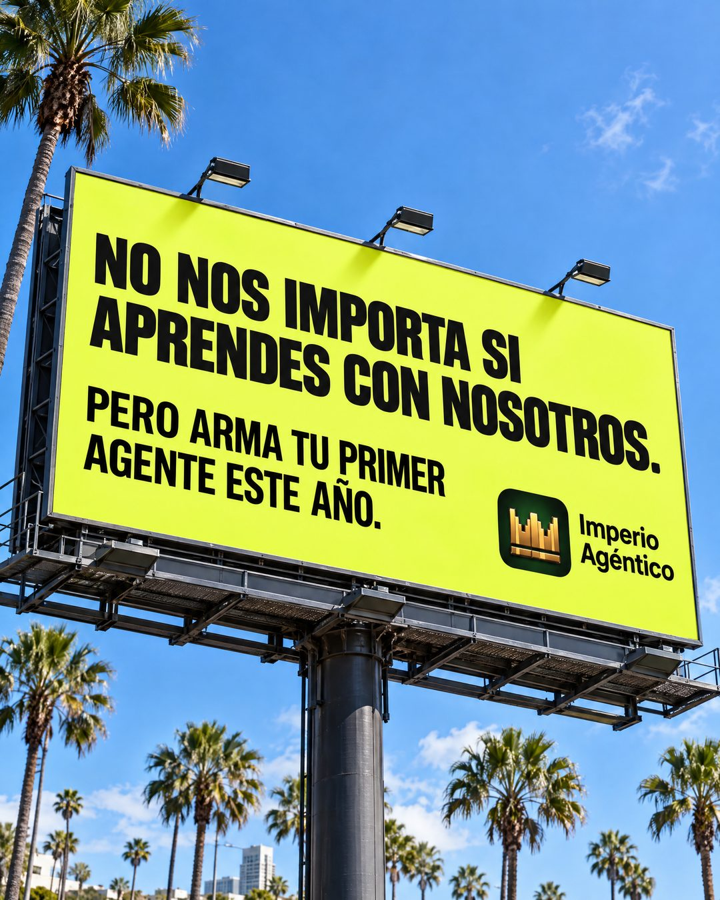

# 214 · Valla que no pide la venta (Native)

**Familia:** Objeto físico con texto · **Necesitas:** Tu logo · **Resultado en Meta:** Sin datos propios todavía



## Qué es
La foto de una valla publicitaria en la calle con un mensaje que le quita importancia a la marca y empuja la acción: no nos importa si lo haces con nosotros, pero hazlo este año. Tu logo va chico en una esquina.

## Por qué funciona
Parece una valla fotografiada y no un anuncio de feed, y lo que parece capturado del mundo rinde más que lo diseñado. El mensaje sorprende porque una marca no suele decir que le da igual si le compras, y esa seguridad genera confianza.

## Cuándo usarlo
Público frío, para marcas con una meta clara del cliente (empezar a entrenar, ahorrar, aprender algo). Sirve para frenar el scroll y ganar confianza antes de vender.

## Así lo hicimos para Imperio
- **Texto en la imagen:** NO NOS IMPORTA SI / APRENDES CON NOSOTROS. / PERO ARMA TU PRIMER / AGENTE ESTE AÑO. / Imperio Agéntico (con el ícono de la corona, abajo a la derecha de la valla)
- **Texto principal:**
  > No nos importa si aprendes con nosotros. Pero arma tu primer agente este año.
  >
  > Y si lo quieres hacer acompañado: 6 sesiones en vivo a la semana y soporte hasta que funcione. $59 al mes 👇

## Receta para tu marca
- **Escena:** foto en contrapicado de una valla gigante contra un cielo azul, con [EL PAISAJE DE TU CIUDAD O DE TU MERCADO] alrededor.
- **Valla:** fondo de un color fuerte (en el ejemplo, amarillo lima) y texto negro grueso en mayúscula.
- **Texto:** NO NOS IMPORTA SI [HACES LO QUE VENDES] CON NOSOTROS. / PERO [LA ACCIÓN QUE TU CLIENTE TIENE QUE TOMAR] ESTE AÑO.
- **Marca:** [TU LOGO] chico en la esquina inferior derecha de la valla.
- **Lo que no se toca:** la renuncia a la venta en la primera frase y la acción con plazo en la segunda.

## Prompt con que se hizo el de Imperio (GPT Image 2.5)
```
Photo of a large roadside billboard against a blue sky with palm trees: lime-yellow billboard with black bold text 'NO NOS IMPORTA SI APRENDES CON NOSOTROS.' / 'PERO ARMA TU PRIMER AGENTE ESTE AÑO.' In the billboard corner: [TU MARCA: logo y nombre]  Vertical 4:5 Instagram/Facebook feed ad, sharp and professional. All on-image text is Spanish and must be rendered EXACTLY as written inside the quotes, with every accent and ñ correct and every digit exact. Never use inverted question marks or inverted exclamation marks. No em dashes. Do not add any other words, logos or watermarks.
```

## Ojo
- Si la valla no existe, no digas en el texto del anuncio que está en una ciudad o una calle real.
- Marca la casilla de contenido generado por IA en el Administrador de anuncios.
