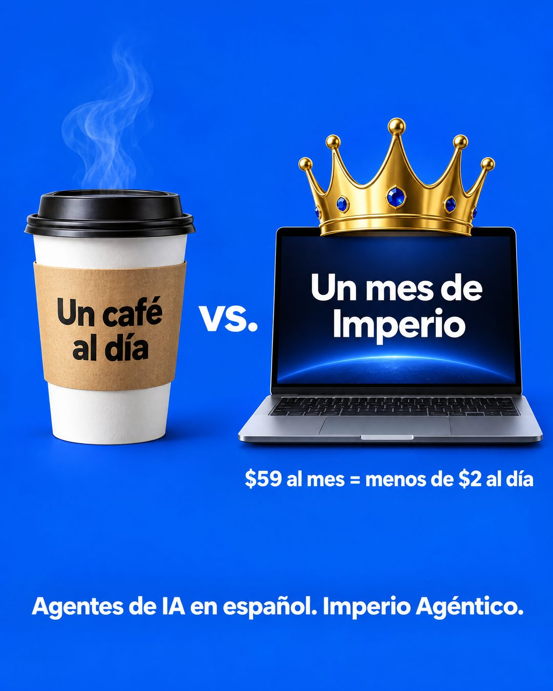

# 215 · Precio contra un gasto diario (Hack 101)

**Familia:** Oferta y precio · **Necesitas:** Nada · **Resultado en Meta:** Sin datos propios todavía



## Qué es
Una comparación lado a lado entre un gasto chico que el cliente hace todos los días y tu producto, con tu precio mensual convertido a precio por día. En el ejemplo de Imperio, un café para llevar contra una laptop con corona: $59 al mes es menos de $2 al día.

## Por qué funciona
Responde la objeción de precio con una cuenta que el cliente puede hacer de cabeza. El café es un gasto que nadie cuestiona, así que tu precio pasa de caro a menos que un café.

## Cuándo usarlo
Público tibio y remarketing que ya quiere el producto pero duda por el precio, en suscripciones, membresías y servicios mensuales. Sirve para responder la objeción de precio.

## Así lo hicimos para Imperio
- **Texto en la imagen:** Un café al día (en la funda del vaso) / vs. / Un mes de Imperio (en la pantalla de la laptop, con una corona encima) / $59 al mes = menos de $2 al día / Agentes de IA en español. Imperio Agéntico.
- **Texto principal:**
  > $59 al mes es menos de $2 al día.
  >
  > Con eso tienes 6 sesiones en vivo a la semana, cerca de 1.000 módulos y soporte hasta que tu flujo funcione.
  >
  > Imperio Agéntico 👇

## Receta para tu marca
- **Fondo:** un color sólido y fuerte de tu marca (en el ejemplo, azul rey).
- **Comparación:** a la izquierda, [UN GASTO DIARIO COMÚN DE TU CLIENTE] con su nombre impreso sobre el objeto; al centro, "vs."; a la derecha, [TU PRODUCTO] con un detalle de tu marca y la etiqueta "Un mes de [TU MARCA]".
- **Cuenta:** bajo tu producto: [TU PRECIO] al mes = menos de [TU PRECIO DIVIDIDO POR 30, REDONDEADO HACIA ARRIBA] al día.
- **Cierre:** abajo, en blanco: [QUÉ ES TU PRODUCTO EN 5 PALABRAS]. [TU MARCA].
- **Lo que no se toca:** un gasto diario que cueste lo mismo o más que tu precio por día, y la cuenta exacta.

## Prompt con que se hizo el de Imperio (GPT Image 2.5)
```
Royal blue ad. Two items side by side with 'vs.' between them: left a takeaway coffee cup labeled 'Un café al día'; right a laptop with a gold crown labeled 'Un mes de Imperio'. Under the right item '$59 al mes = menos de $2 al día'. Bottom white text 'Agentes de IA en español. Imperio Agéntico.' Vertical 4:5 Instagram/Facebook feed ad, sharp and professional. All on-image text is Spanish and must be rendered EXACTLY as written inside the quotes, with every accent and ñ correct and every digit exact. Never use inverted question marks or inverted exclamation marks. No em dashes. Do not add any other words, logos or watermarks.
```

## Ojo
- Haz la cuenta con tu precio real: si dices menos de $2 al día, tu precio mensual dividido por 30 tiene que dar menos de $2.
- Marca la casilla de contenido generado por IA en el Administrador de anuncios.
