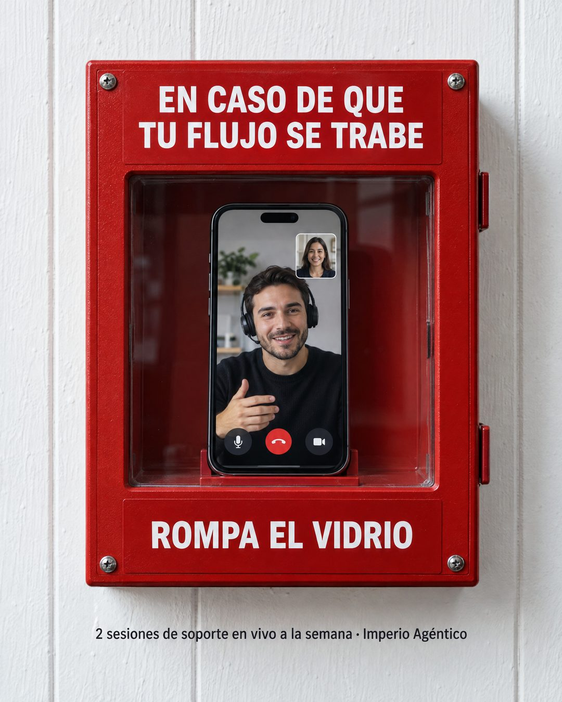

# 216 · Caja de emergencia para el soporte (Emergency)

**Familia:** Objeto físico con texto · **Necesitas:** Nada · **Resultado en Meta:** Sin datos propios todavía



## Qué es
Una caja roja de emergencia colgada en la pared, con un rótulo arriba que nombra el problema del cliente, tu servicio detrás del vidrio y el clásico ROMPA EL VIDRIO abajo. En el ejemplo de Imperio, detrás del vidrio hay un teléfono con una videollamada de soporte.

## Por qué funciona
Es un objeto real que todos reconocen, y lo fotografiado rinde más que lo diseñado. Convierte tu soporte en el recurso de emergencia y responde la duda de qué pasa si el cliente se traba, con un dato concreto abajo (2 sesiones a la semana).

## Cuándo usarlo
Público tibio que teme quedarse solo después de comprar, en cursos, software, servicios técnicos o cualquier oferta con soporte. Sirve para responder la objeción de quedarse trabado.

## Así lo hicimos para Imperio
- **Texto en la imagen:** EN CASO DE QUE / TU FLUJO SE TRABE / [teléfono con una videollamada de soporte detrás del vidrio] / ROMPA EL VIDRIO / 2 sesiones de soporte en vivo a la semana · Imperio Agéntico (letra chica, bajo la caja)
- **Texto principal:**
  > En caso de que tu flujo se trabe: rompa el vidrio.
  >
  > Hay 2 sesiones de soporte en vivo a la semana y revisamos tus flujos hasta que funcionen.
  >
  > $59 al mes 👇

## Receta para tu marca
- **Escena:** foto frontal de una caja roja de emergencia atornillada a una pared de madera blanca, con frente de vidrio y luz natural.
- **Rótulo superior:** blanco sobre rojo: EN CASO DE QUE [TU PROBLEMA MÁS TEMIDO, EN 5 PALABRAS].
- **Adentro:** [TU AYUDA EN UNA IMAGEN, COMO UN TELÉFONO CON TU SOPORTE O UN MANUAL].
- **Rótulo inferior y cierre:** ROMPA EL VIDRIO en la caja; bajo la caja, en letra chica: [CUÁNTO SOPORTE INCLUYE Y CADA CUÁNTO] · [TU MARCA].
- **Lo que no se toca:** el rojo de emergencia y la frase clásica del vidrio; si cambias la señal, se pierde el reconocimiento.

## Prompt con que se hizo el de Imperio (GPT Image 2.5)
```
Photo of a white wooden wall with a red wall-mounted emergency box with a glass front, label at the top 'EN CASO DE QUE TU FLUJO SE TRABE', inside it a smartphone showing a live video call support session, label at the bottom 'ROMPA EL VIDRIO'. Small text below the box '2 sesiones de soporte en vivo a la semana · Imperio Agéntico'. Vertical 4:5 Instagram/Facebook feed ad, sharp and professional. All on-image text is Spanish and must be rendered EXACTLY as written inside the quotes, with every accent and ñ correct and every digit exact. Never use inverted question marks or inverted exclamation marks. No em dashes. Do not add any other words, logos or watermarks.
```

## Ojo
- El soporte que muestras tiene que existir con esa frecuencia: si dices 2 sesiones a la semana, que sean 2.
- Las caras de la videollamada son generadas: no las presentes como tu equipo ni les pongas nombre; si quieres, usa tu cara.
- Marca la casilla de contenido generado por IA en el Administrador de anuncios.
