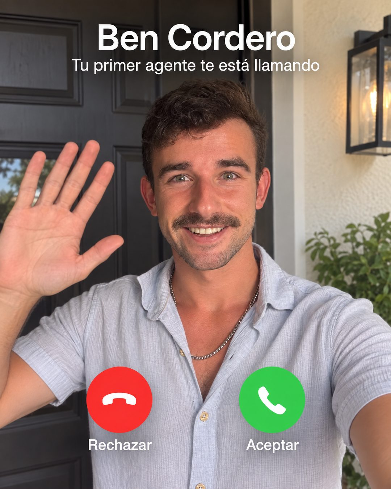

# 218 · Llamada entrante tipo FaceTime (Greenscreen)

**Familia:** Interfaz creíble · **Necesitas:** Una o dos fotos tuyas · **Resultado en Meta:** Sin datos propios todavía



## Qué es
La pantalla de una videollamada entrante: tú en una selfie saludando a la cámara, tu nombre arriba y una línea que dice que lo que el cliente quiere lo está llamando. Abajo, los botones rojo y verde de rechazar y aceptar.

## Por qué funciona
Una llamada entrante pide una decisión inmediata y el ojo busca quién llama. Tu cara en vez de un logo es autoridad propia, y el texto convierte el botón de aceptar en el llamado a la acción.

## Cuándo usarlo
Público frío y tibio, para marcas personales, coaches, consultores, creadores o negocios donde la cara del dueño genera confianza. Sirve para frenar el scroll y empujar el clic.

## Así lo hicimos para Imperio
- **Texto en la imagen:** Ben Cordero / Tu primer agente te está llamando / Rechazar (botón rojo) / Aceptar (botón verde)
- **Texto principal:**
  > Te está llamando tu primer agente (bueno, soy yo, jajaja).
  >
  > Contesta: un caso, una base que ya funciona y 7 días. Si no anda, te devolvemos el 100%.
  >
  > $59 al mes 👇

## Receta para tu marca
- **Formato:** pantalla completa de videollamada entrante, sin marco de teléfono.
- **Escena:** selfie tuya saludando con la mano frente a [UN LUGAR TUYO RECONOCIBLE, COMO TU CASA, TU LOCAL O TU OFICINA], con luz natural.
- **Texto:** arriba, [TU NOMBRE] en blanco y grande, y debajo [LO QUE TU CLIENTE QUIERE] te está llamando.
- **Botones:** abajo, uno rojo con "Rechazar" y uno verde con "Aceptar", con sus íconos de teléfono.
- **Lo que no se toca:** tu cara real y la línea de quién llama; si llama un logo, nadie contesta.

## Prompt con que se hizo el de Imperio (GPT Image 2.5)
```
[Si el formato lleva tu cara: adjunta 1 o 2 fotos tuyas como referencia y escribe: the person is exactly the one in the reference photos] iPhone FaceTime incoming call screen: full-screen selfie video of him waving at the camera in front of a house doorway. Top text 'Ben Cordero' and below it 'Tu primer agente te está llamando'. Bottom: red round button labeled 'Rechazar' and green round button labeled 'Aceptar'. Vertical 4:5 Instagram/Facebook feed ad, sharp and professional. All on-image text is Spanish and must be rendered EXACTLY as written inside the quotes, with every accent and ñ correct and every digit exact. Never use inverted question marks or inverted exclamation marks. No em dashes. Do not add any other words, logos or watermarks.
```

## Ojo
- No uses el nombre ni el logo de FaceTime o de Apple: la pantalla de llamada se entiende sin ellos.
- Si sale texto roto, manos deformes o cifras mal escritas, se rehace.
- Marca la casilla de contenido generado por IA en el Administrador de anuncios.
