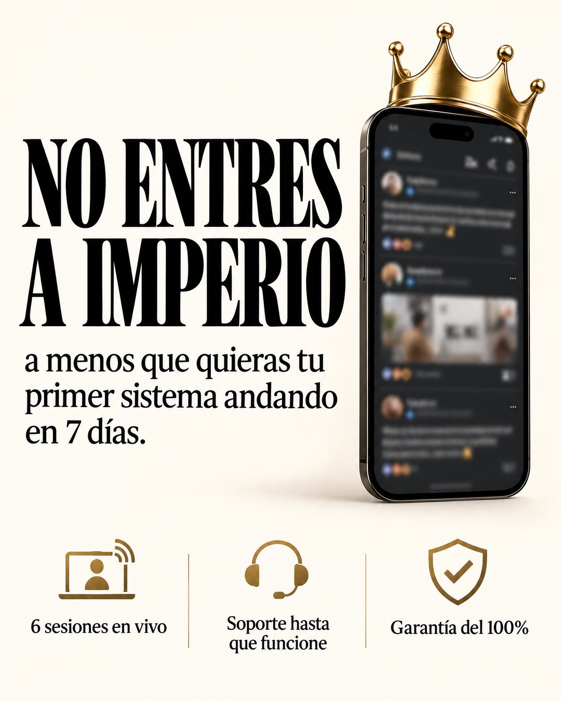

# 219 · Prohibido comprar, con condición (Don't buy this)

**Familia:** Tipografía dura · **Necesitas:** Nada · **Resultado en Meta:** Sin datos propios todavía



## Qué es
Un titular serif gigante que le prohíbe al cliente comprar, seguido de una condición que lo da vuelta: a menos que quiera un resultado concreto con plazo. Abajo, tres íconos con lo que incluye la oferta.

## Por qué funciona
La prohibición invierte lo que se espera de un anuncio y obliga a leer la segunda línea. La condición es una promesa concreta (tu primer sistema andando en 7 días) y los íconos responden de inmediato cómo se cumple.

## Cuándo usarlo
Público frío y tibio, para cualquier oferta con un resultado medible y un plazo claro. Sirve para frenar el scroll y presentar la promesa con lo que la respalda.

## Así lo hicimos para Imperio
- **Texto en la imagen:** NO ENTRES / A IMPERIO / a menos que quieras tu / primer sistema andando / en 7 días. / [teléfono con corona dorada y un feed de comunidad desenfocado] / 6 sesiones en vivo / Soporte hasta que funcione / Garantía del 100% (tres íconos dorados, abajo)
- **Texto principal:**
  > No entres a Imperio. A menos que quieras tu primer sistema andando en 7 días.
  >
  > 6 sesiones en vivo, soporte hasta que funcione y garantía del 100%.
  >
  > $59 al mes 👇

## Receta para tu marca
- **Fondo:** crema liso.
- **Titular:** serif condensada negra y enorme, en dos líneas: NO [COMPRES O ENTRES A] [TU MARCA].
- **Condición:** debajo, en serif más chica: a menos que quieras [TU RESULTADO CONCRETO CON PLAZO].
- **Apoyo:** a la derecha, [TU PRODUCTO O UN TELÉFONO CON TU PRODUCTO DESENFOCADO] con un detalle dorado de tu marca; abajo, tres íconos dorados con [INCLUYE 1], [INCLUYE 2] y [TU GARANTÍA REAL].
- **Lo que no se toca:** la prohibición gigante y la condición con plazo; sin plazo, la frase pierde el gancho.

## Prompt con que se hizo el de Imperio (GPT Image 2.5)
```
Cream background. Huge black serif caps 'NO ENTRES' / 'A IMPERIO'. Small subtext 'a menos que quieras tu primer sistema andando en 7 días.' Right: a phone showing an online community feed with a gold crown on top. All post texts, names and avatars on that phone screen are blurred and completely illegible, no readable words on the phone at all. Bottom row of three small icons with labels '6 sesiones en vivo', 'Soporte hasta que funcione', 'Garantía del 100%'. Vertical 4:5 Instagram/Facebook feed ad, sharp and professional. All on-image text is Spanish and must be rendered EXACTLY as written inside the quotes, with every accent and ñ correct and every digit exact. Never use inverted question marks or inverted exclamation marks. No em dashes. Do not add any other words, logos or watermarks.
```

## Ojo
- El plazo y la garantía tienen que ser los mismos de tus condiciones: si no hay garantía firmada, no la pongas.
- Desenfoca cualquier pantalla con nombres o fotos de clientes.
- Marca la casilla de contenido generado por IA en el Administrador de anuncios.
