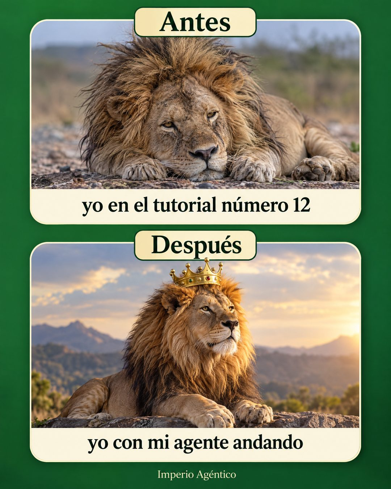

# 220 · Meme del antes y después

**Familia:** Humor y meme · **Necesitas:** Nada · **Resultado en Meta:** Sin datos propios todavía



## Qué es
Un meme de dos paneles apilados, Antes y Después, con el mismo animal o personaje en dos estados y una frase en primera persona bajo cada foto. En el ejemplo de Imperio, un león agotado en el tutorial número 12 y el mismo león con corona cuando su agente ya anda.

## Por qué funciona
El antes y después es de los formatos más reconocibles de internet y se entiende sin leer. La primera persona (yo en el tutorial número 12) hace que el cliente se ría de sí mismo, y el número concreto lo vuelve creíble.

## Cuándo usarlo
Público frío, para cualquier negocio que lleva al cliente de un estado frustrante a uno resuelto. Sirve para frenar el scroll y generar comentarios y compartidos.

## Así lo hicimos para Imperio
- **Texto en la imagen:** Antes / yo en el tutorial número 12 / Después / yo con mi agente andando / Imperio Agéntico (letra chica, abajo)
- **Texto principal:**
  > Antes: tú en el tutorial número 12.
  > Después: tú con el agente andando 👑
  >
  > Del uno al otro hay una ruta. Tu primer sistema en 7 días o te devolvemos el 100%. $59 al mes 👇

## Receta para tu marca
- **Fondo:** un color sólido de tu marca (en el ejemplo, verde) con dos paneles de esquinas redondeadas.
- **Rótulos:** "Antes" y "Después" en serif negra, sobre una etiqueta crema centrada en el borde superior de cada panel.
- **Fotos:** el mismo [ANIMAL O PERSONAJE] en dos estados: agotado y despeinado arriba, orgulloso y con [UN DETALLE DE TU MARCA] abajo.
- **Frases:** bajo cada foto, en serif: yo en [LA SITUACIÓN FRUSTRANTE, CON NÚMERO] / yo con [EL RESULTADO DE TU PRODUCTO].
- **Lo que no se toca:** el mismo personaje en los dos paneles, la primera persona y tu marca en letra chica al pie.

## Prompt con que se hizo el de Imperio (GPT Image 2.5)
```
Green background meme, two stacked panels with serif labels 'Antes' and 'Después'. Top panel: a realistic lion looking exhausted and messy lying down, caption 'yo en el tutorial número 12'. Bottom panel: the same lion proud and majestic wearing a small gold crown, caption 'yo con mi agente andando'. Small 'Imperio Agéntico'. Vertical 4:5 Instagram/Facebook feed ad, sharp and professional. All on-image text is Spanish and must be rendered EXACTLY as written inside the quotes, with every accent and ñ correct and every digit exact. Never use inverted question marks or inverted exclamation marks. No em dashes. Do not add any other words, logos or watermarks.
```

## Ojo
- Si vendes salud, estética o bajar de peso, no uses fotos de personas en el antes y después: Meta las rechaza; usa un animal o un personaje como en el ejemplo.
- Marca la casilla de contenido generado por IA en el Administrador de anuncios.
