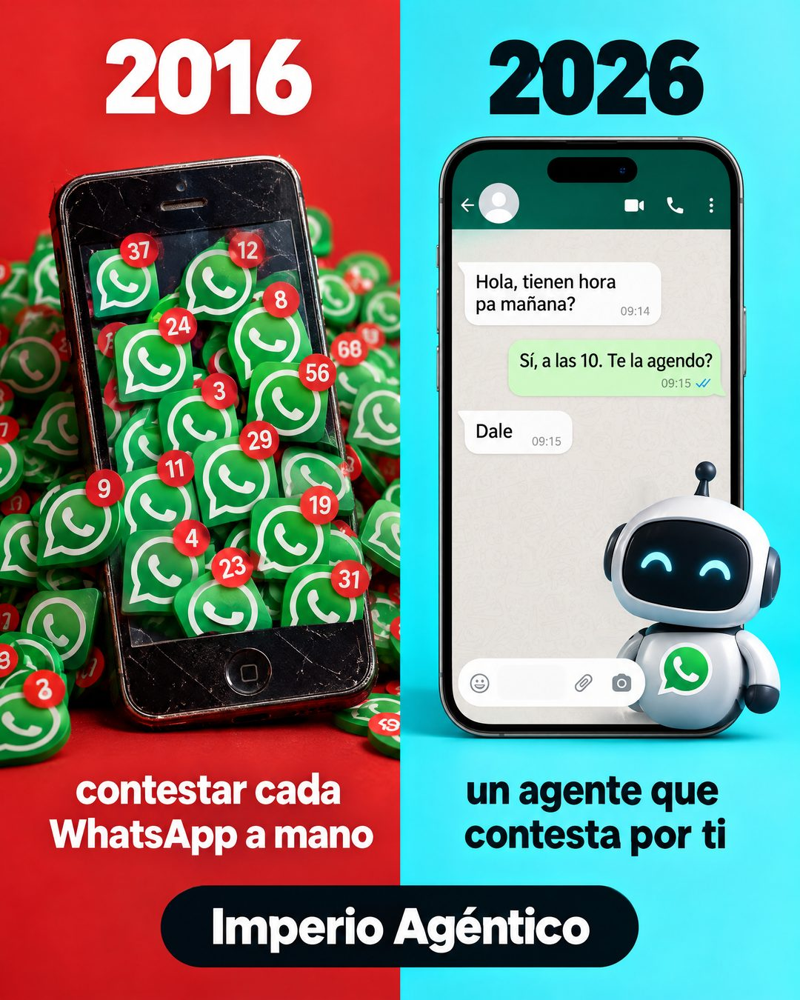

# 221 · Hace diez años contra hoy (New vs old)

**Familia:** Diagrama y dato · **Necesitas:** Nada · **Resultado en Meta:** Sin datos propios todavía



## Qué es
Una imagen partida en dos colores: a la izquierda, un año de hace una década con la forma vieja de hacer las cosas; a la derecha, el año actual con tu solución funcionando. En el ejemplo de Imperio, un teléfono viejo tapado de notificaciones de WhatsApp contra un chat que contesta un agente.

## Por qué funciona
La comparación se entiende en un vistazo y hace ver la forma vieja como algo de otra época. El chat del lado derecho es una demostración concreta de lo que hace el producto, con un diálogo corto y creíble.

## Cuándo usarlo
Público frío, para negocios que reemplazan una tarea manual con una herramienta o un servicio. Sirve para frenar el scroll y mostrar la diferencia antes de explicar el producto.

## Así lo hicimos para Imperio
- **Texto en la imagen:** 2016 (izquierda, fondo rojo) / [teléfono viejo tapado de íconos de WhatsApp con globos rojos de notificación] / contestar cada WhatsApp a mano / 2026 (derecha, fondo celeste) / Hola, tienen hora pa mañana? / Sí, a las 10. Te la agendo? / Dale / [robot con el logo de WhatsApp en el pecho] / un agente que contesta por ti / Imperio Agéntico (píldora negra, abajo al centro)
- **Texto principal:**
  > 2016: contestar cada WhatsApp a mano.
  > 2026: un agente que contesta por ti.
  >
  > Aprende a montarlo en Imperio, con el curso de Agentes de WhatsApp (instalación en 1 clic). $59 al mes 👇

## Receta para tu marca
- **Formato:** fondo partido en vertical en dos colores que contrastan (en el ejemplo, rojo y celeste), con el año grande arriba de cada mitad: [AÑO DE HACE 10 AÑOS] y [AÑO ACTUAL].
- **Izquierda:** [EL OBJETO DE LA FORMA VIEJA] desbordado por el problema, con la frase [LA TAREA VIEJA, EN 5 PALABRAS].
- **Derecha:** [TU PRODUCTO FUNCIONANDO, COMO UN CHAT DE DEMOSTRACIÓN DE TRES MENSAJES], con la frase [LO QUE HACE TU SOLUCIÓN, EN 5 PALABRAS].
- **Marca:** [TU MARCA] en una píldora negra, abajo al centro.
- **Lo que no se toca:** el mismo peso visual en las dos mitades y un diálogo de demostración corto, escrito como lo escribiría tu cliente.

## Prompt con que se hizo el de Imperio (GPT Image 2.5)
```
Background split vertically: left red, right cyan. Left top '2016', right top '2026'. Left: an old phone buried in WhatsApp notification badges, caption 'contestar cada WhatsApp a mano'. Right: a modern smartphone with a small friendly robot icon and a WhatsApp chat with only these messages: customer 'Hola, tienen hora pa mañana?', agent 'Sí, a las 10. Te la agendo?', customer 'Dale'; caption 'un agente que contesta por ti'. Bottom center 'Imperio Agéntico'. Every chat message is written WITHOUT inverted question marks and WITHOUT inverted exclamation marks (never the characters U+00BF or U+00A1 anywhere, questions only end with ?). Vertical 4:5 Instagram/Facebook feed ad, sharp and professional. All on-image text is Spanish and must be rendered EXACTLY as written inside the quotes, with every accent and ñ correct and every digit exact. Never use inverted question marks or inverted exclamation marks. No em dashes. Do not add any other words, logos or watermarks.
```

## Ojo
- El chat es una demostración de tu producto, nunca la captura de un cliente real: no le pongas nombre ni foto.
- Si sale texto roto, manos deformes o cifras mal escritas, se rehace.
- Marca la casilla de contenido generado por IA en el Administrador de anuncios.
