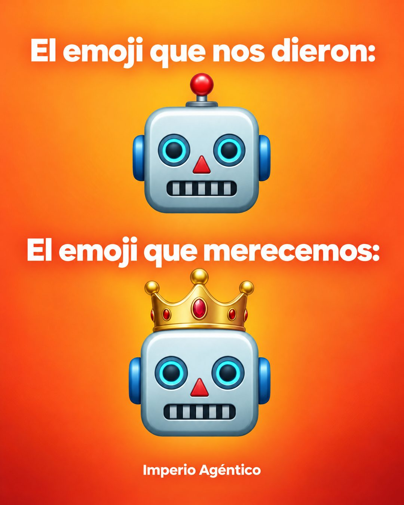

# 222 · El emoji que merecemos (Us vs us)

**Familia:** Humor y meme · **Necesitas:** Nada · **Resultado en Meta:** Sin datos propios todavía



## Qué es
Un meme en dos tiempos sobre fondo de color: el emoji que nos dieron, con un emoji común, y el emoji que merecemos, con el mismo emoji y un detalle de tu marca. En el ejemplo de Imperio, el robot de siempre y el mismo robot con corona.

## Por qué funciona
Los emojis se reconocen al instante y el meme ya es conocido, así que se entiende sin leer. El detalle agregado asocia tu marca con la versión mejor de algo que la gente usa todos los días.

## Cuándo usarlo
Público frío, para marcas con un símbolo simple que se puede poner sobre un emoji (una corona, un gorro, unos anteojos). Sirve para frenar el scroll y fijar el símbolo de tu marca.

## Así lo hicimos para Imperio
- **Texto en la imagen:** El emoji que nos dieron: / [emoji de robot] / El emoji que merecemos: / [el mismo emoji de robot con una corona dorada] / Imperio Agéntico (letra chica, abajo)
- **Texto principal:**
  > El emoji que nos dieron: 🤖
  > El emoji que merecemos: 🤖👑
  >
  > Agentes de IA en español, en Imperio Agéntico. $59 al mes 👇

## Receta para tu marca
- **Fondo:** degradado cálido del color de tu marca (en el ejemplo, naranja).
- **Arriba:** en blanco y negrita, "El emoji que nos dieron:" y debajo [UN EMOJI DE TU RUBRO] en grande.
- **Abajo:** "El emoji que merecemos:" y el mismo emoji con [EL SÍMBOLO DE TU MARCA] encima.
- **Marca:** [TU MARCA] en letra chica blanca al pie.
- **Lo que no se toca:** el mismo emoji en los dos tiempos; solo cambia tu símbolo.

## Prompt con que se hizo el de Imperio (GPT Image 2.5)
```
Warm orange gradient background. Top white bold 'El emoji que nos dieron:' and a big robot face emoji. Middle white bold 'El emoji que merecemos:' and a big robot face emoji wearing a gold crown. Bottom small 'Imperio Agéntico'. Vertical 4:5 Instagram/Facebook feed ad, sharp and professional. All on-image text is Spanish and must be rendered EXACTLY as written inside the quotes, with every accent and ñ correct and every digit exact. Never use inverted question marks or inverted exclamation marks. No em dashes. Do not add any other words, logos or watermarks.
```

## Ojo
- Pide un emoji dibujado con estilo propio y no la copia exacta del set de Apple o de Google: ese diseño tiene dueño.
- Marca la casilla de contenido generado por IA en el Administrador de anuncios.
