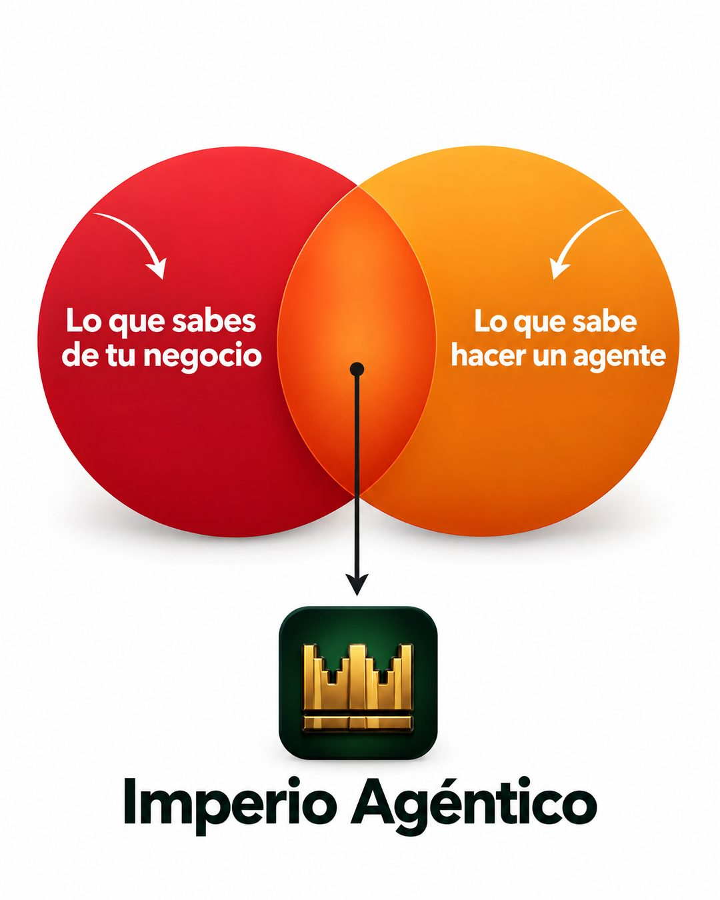

# 223 · Diagrama de Venn con tu marca (Venn diagram)

**Familia:** Diagrama y dato · **Necesitas:** Tu logo · **Resultado en Meta:** Sin datos propios todavía



## Qué es
Dos círculos que se cruzan, uno con lo que el cliente ya sabe o tiene y otro con lo que aporta tu producto, y una flecha que baja desde la intersección hasta tu logo. En el ejemplo de Imperio: lo que sabes de tu negocio y lo que sabe hacer un agente.

## Por qué funciona
El Venn se entiende sin leer y pone a la marca justo donde se juntan dos cosas que el cliente valora. Le da crédito al cliente, porque él pone una mitad, y eso baja la sensación de que tiene que empezar de cero.

## Cuándo usarlo
Público frío y tibio, para servicios que combinan el conocimiento del cliente con una herramienta o un método. Sirve para explicar tu propuesta en una sola imagen.

## Así lo hicimos para Imperio
- **Texto en la imagen:** Lo que sabes de tu negocio (círculo rojo) / Lo que sabe hacer un agente (círculo naranja) / [flecha desde la intersección hasta el ícono de la corona] / Imperio Agéntico
- **Texto principal:**
  > Lo que sabes de tu negocio + lo que sabe hacer un agente = tu primer sistema.
  >
  > Tú pones lo primero. Adentro aprendes lo segundo, con soporte en vivo.
  >
  > $59 al mes 👇

## Receta para tu marca
- **Fondo:** blanco liso.
- **Círculos:** dos círculos grandes que se cruzan, en dos colores de tu marca, con texto blanco: [LO QUE EL CLIENTE YA TIENE] y [LO QUE APORTA TU PRODUCTO], cada uno con una flecha curva.
- **Intersección:** un punto en el cruce y una línea que baja con una flecha.
- **Marca:** [TU LOGO] y [TU MARCA] en negrita negra, abajo al centro.
- **Lo que no se toca:** dos círculos, no tres, y tu marca como única respuesta de la flecha.

## Prompt con que se hizo el de Imperio (GPT Image 2.5)
```
White ad. Two overlapping circles: left red circle labeled with an arrow 'Lo que sabes de tu negocio', right orange circle labeled 'Lo que sabe hacer un agente'. A thin arrow from the overlap down to: [TU MARCA: logo y nombre]  Vertical 4:5 Instagram/Facebook feed ad, sharp and professional. All on-image text is Spanish and must be rendered EXACTLY as written inside the quotes, with every accent and ñ correct and every digit exact. Never use inverted question marks or inverted exclamation marks. No em dashes. Do not add any other words, logos or watermarks.
```

## Ojo
- Usa los colores de tu marca: un círculo rojo cruzado con uno naranja recuerda al logo de una tarjeta de crédito conocida.
- Marca la casilla de contenido generado por IA en el Administrador de anuncios.
